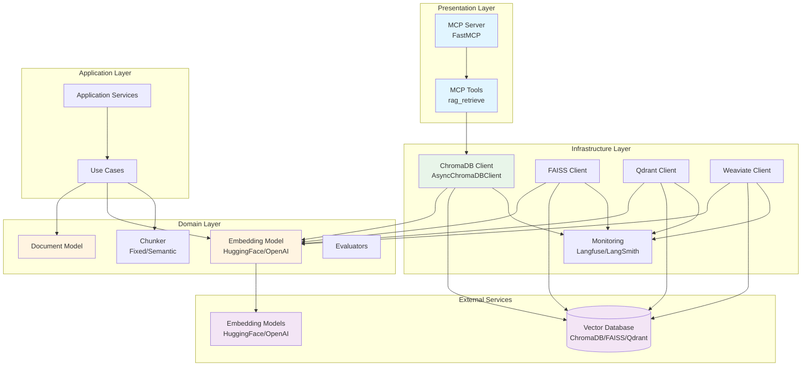
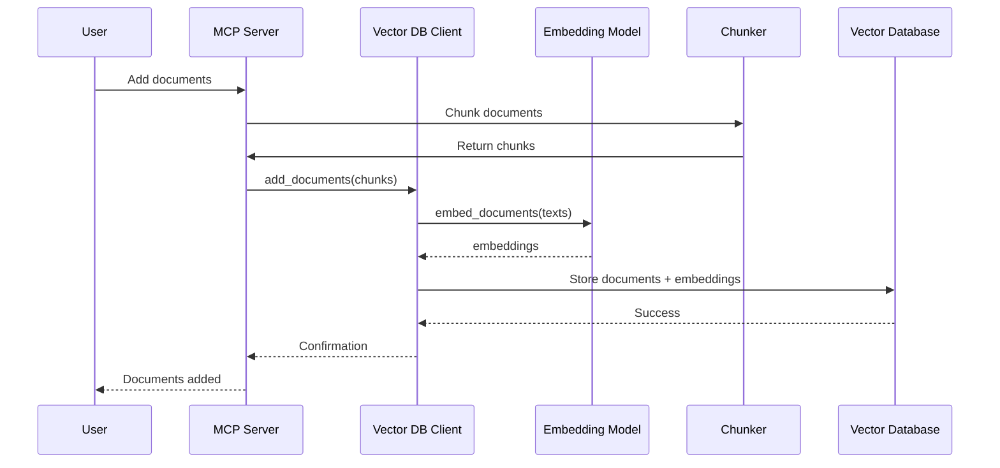
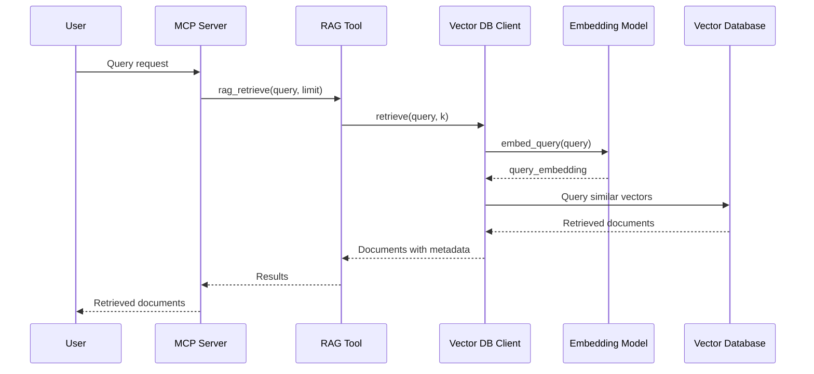

# RAGProd Architecture

## Overview

RAGProd is a Retrieval-Augmented Generation (RAG) production system built with a clean architecture pattern. It provides a modular framework for document embedding, storage, and retrieval using vector databases.

## Directory Structure

```
ragprod/
├── src/
│   └── ragprod/
│       ├── __init__.py
│       │
│       ├── domain/                          # Core business logic
│       │   ├── chunk/                       # Document chunking strategies
│       │   │   ├── base.py                  # Base chunker interface
│       │   │   ├── chunker.py               # Chunker implementation
│       │   │   ├── semantic_chunking.py     # Semantic chunking
│       │   │   └── splitters/               # Text splitter utilities
│       │   │
│       │   ├── client/                      # Vector database client abstractions
│       │   │   ├── base.py                  # BaseClient interface
│       │   │   └── __init__.py
│       │   │
│       │   ├── document/                    # Document models
│       │   │   ├── base.py                  # BaseDocument interface
│       │   │   └── document.py              # Document implementation
│       │   │
│       │   ├── embedding/                   # Embedding model abstractions
│       │   │   ├── base.py                  # EmbeddingModel interface
│       │   │   ├── huggingface_embedding.py # HuggingFace implementation
│       │   │   ├── openai_embedding.py      # OpenAI implementation
│       │   │   ├── colbert_embeddings.py    # ColBERT implementation
│       │   │   └── quantization.py          # Quantization utilities
│       │   │
│       │   ├── encoder/                     # Encoder implementations
│       │   │   ├── bie.py                   # Bi-encoder
│       │   │   ├── colbert.py               # ColBERT encoder
│       │   │   └── cross.py                 # Cross-encoder
│       │   │
│       │   ├── evaluator/                   # Evaluation tools
│       │   │   ├── human_annot_eval.py      # Human annotation evaluation
│       │   │   ├── llm_as_judge_eval.py     # LLM-as-judge evaluation
│       │   │   ├── llm_performance_eval.py  # LLM performance evaluation
│       │   │   └── retrieval_eval.py        # Retrieval evaluation
│       │   │
│       │   └── prompt/                      # Prompt optimization
│       │       └── prompt_optimizer.py
│       │
│       ├── infrastructure/                  # External service integrations
│       │   ├── client/                      # Vector database clients
│       │   │   ├── chromadb.py              # ChromaDB async client
│       │   │   ├── faiss.py                 # FAISS client
│       │   │   ├── qdrant.py                # Qdrant client
│       │   │   ├── weaviate.py              # Weaviate client
│       │   │   └── __init__.py
│       │   │
│       │   └── monitoring/                  # Observability tools
│       │       ├── base.py                  # Base monitoring interface
│       │       ├── langfuse.py              # Langfuse integration
│       │       ├── langsmith.py             # LangSmith integration
│       │       └── phoenix.py               # Phoenix integration
│       │
│       ├── application/                     # Application services
│       │   ├── service.py                   # Application services
│       │   └── use_cases/                   # Use case implementations
│       │
│       └── presentation/                    # External interfaces
│           ├── api/                         # REST API (placeholder)
│           └── mcp/                         # Model Context Protocol server
│               ├── server.py                # FastMCP server instance
│               ├── client.py                # Database client initialization
│               ├── run.py                   # Server entry point
│               ├── add_docs.py              # Document addition utilities
│               ├── test_client.py           # Test client for MCP
│               └── tools/                   # MCP tools
│                   ├── rag.py               # RAG retrieval tool
│                   └── __init__.py
│
├── docs/                                    # Documentation
│   └── architecture.md                      # This file
│
├── notebooks/                               # Jupyter notebooks
│   ├── 01intro/                             # Introduction notebooks
│   ├── 03weviate/                           # Weaviate examples
│   ├── llm/                                 # LLM examples
│   ├── monitor/                             # Monitoring examples
│   └── *.ipynb                              # Various test notebooks
│
├── notes/                                   # Development notes
│   └── intro.md
│
├── chromadb_test/                           # ChromaDB test data
│
├── pyproject.toml                           # Project configuration
├── uv.lock                                  # Dependency lock file
├── Dockerfile                               # Docker configuration
├── docker-compose.yaml                      # Docker Compose configuration
├── Makefile                                 # Build automation
└── README.md                                # Project README
```

## Architecture Layers

### 1. Domain Layer (`domain/`)
Core business logic and entities. Contains:
- **Documents**: Document models with metadata
- **Embeddings**: Embedding model interfaces and implementations
- **Chunking**: Document chunking strategies
- **Evaluators**: Evaluation tools for RAG systems
- **Encoders**: Different encoder types (bi-encoder, cross-encoder, ColBERT)

### 2. Infrastructure Layer (`infrastructure/`)
External service integrations:
- **Vector Databases**: Clients for ChromaDB, FAISS, Qdrant, Weaviate
- **Monitoring**: Observability tools (Langfuse, LangSmith, Phoenix)

### 3. Application Layer (`application/`)
Application services and use cases (currently minimal, ready for expansion)

### 4. Presentation Layer (`presentation/`)
External interfaces:
- **MCP Server**: Model Context Protocol server exposing RAG tools
- **API**: REST API (placeholder for future development)

## System Flow



## Component Interaction Flow

### Document Ingestion Flow



### Query Retrieval Flow



## Key Design Patterns

1. **Clean Architecture**: Separation of concerns across layers
2. **Dependency Inversion**: Domain layer doesn't depend on infrastructure
3. **Strategy Pattern**: Multiple embedding models and vector databases
4. **Factory Pattern**: Client factory functions for different database modes
5. **Async/Await**: Asynchronous operations throughout the stack

## Technology Stack

- **Language**: Python 3.11
- **Vector Databases**: ChromaDB, FAISS, Qdrant, Weaviate
- **Embedding Models**: HuggingFace Transformers, OpenAI
- **MCP Framework**: FastMCP
- **Monitoring**: Langfuse, LangSmith, Phoenix
- **Package Management**: UV (with PyTorch variants: CPU, CUDA, ROCm)

## Configuration

The system supports multiple deployment modes:
- **Local Persistent**: ChromaDB with local file storage
- **Remote API**: ChromaDB via HTTP API
- **In-Memory**: Transient storage for testing
- **Multiple Vector DBs**: Swappable backends (ChromaDB, FAISS, Qdrant, Weaviate)

